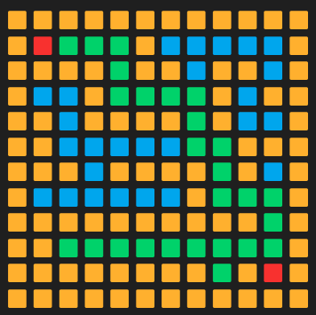
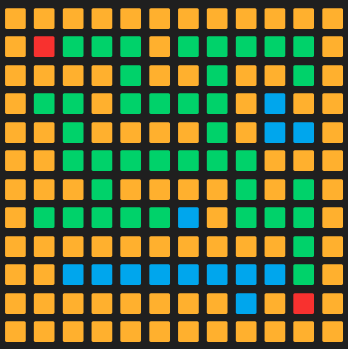
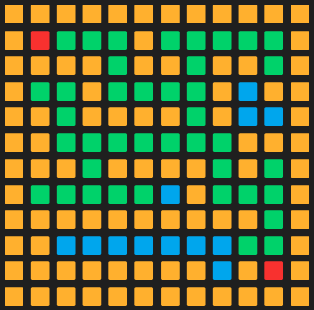
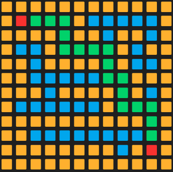

# Maze Solver Visualization

## About the Project
This project visualizes the process of solving a maze using multiple pathfinding algorithms. It provides a unique insight into how each algorithm approaches the problem, with animations to show visited nodes, shortest paths, and exploration patterns in real-time. Users can observe how each algorithm behaves differently in various maze configurations.

### Key Features
- **Real-Time Visualization**: Observe each algorithm's step-by-step process.
- **Custom Maze Generation**: Draw custom mazes or generate random configurations.
- **Algorithm Comparison**: Compare how different algorithms tackle the same maze.

## Algorithms Overview
### Depth First Search (DFS)
DFS explores as far as possible down each branch before backtracking, often leading to long paths that aren’t necessarily the shortest. It performs well in dense mazes but doesn’t guarantee the shortest path.

### Breadth First Search (BFS)
BFS explores the maze layer by layer, ensuring that the shortest path is found in an unweighted maze. It explores all neighbors of the current position before moving to the next level, resulting in efficient pathfinding in most cases.

### Dijkstra's Algorithm
Dijkstra's Algorithm finds the shortest path by visiting nodes in increasing order of their distance from the start, making it ideal for weighted mazes. It ensures the shortest path is found but can be computationally intensive in larger mazes.

### A* Search
A* combines BFS with heuristics to optimize its search. It prioritizes nodes that are close to both the starting point and the goal, making it faster than Dijkstra in many cases, while still guaranteeing the shortest path in unweighted or weighted mazes.

## Screenshots
| Algorithm          | Screenshot                                                   |
|--------------------|--------------------------------------------------------------|
| **Depth First Search (DFS)** |                        |
| **Breadth First Search (BFS)** |                      |
| **Dijkstra's Algorithm** |                  |
| **A* Search** |                                     |

